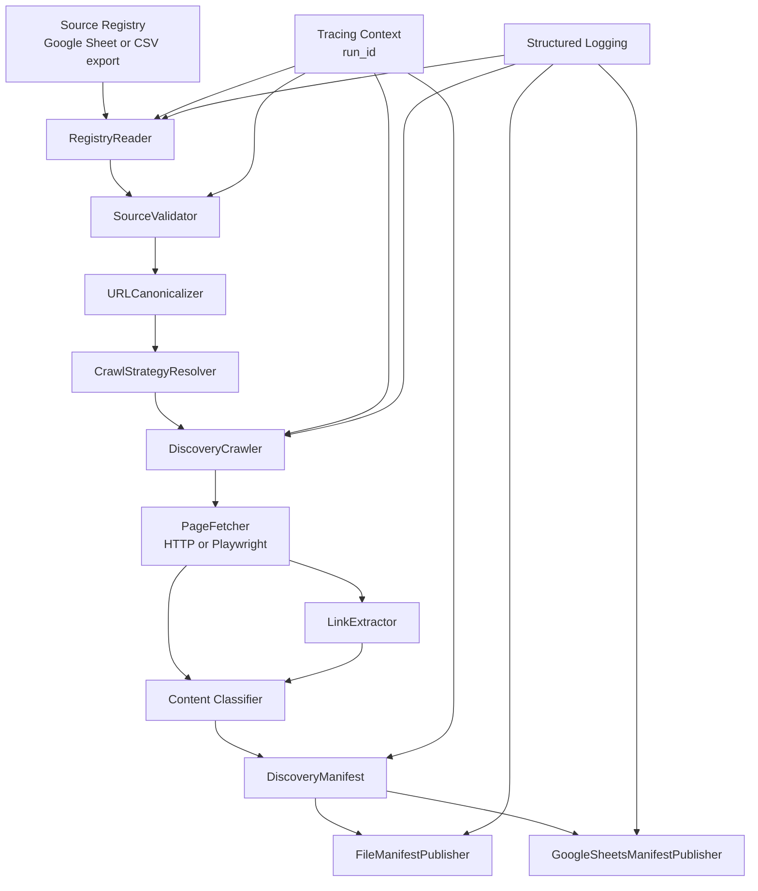

# Discovery Engine Architecture

## Purpose

The Discovery Engine is the first operational stage of the Nidarsha pipeline.
It reads the source registry, validates and normalizes active sources, fetches
the source landing page, extracts discovered links, classifies each discovered
resource, and emits deterministic manifest records for downstream use.

This stage now does real discovery work. It is not only a registry reader or a
schema validator. The current implementation crawls each enabled source using a
strategy-specific fetcher and produces manifest records for the landing page and
for each discovered link on that page.

## Current Runtime Flow

The current executable entrypoint is `scripts/run_discovery.py`.

At runtime it performs the following sequence:

1. Load `.env` values into the process environment if present.
2. Load typed settings from environment variables.
3. Require `NIDARSHA_REGISTRY_SHEET_URL`.
4. Build a `RegistryReader` with registry settings and discovery settings.
5. Build a `DiscoveryEngine`.
6. Build a local JSON `FileManifestPublisher`.
7. Optionally build a `GoogleSheetsManifestPublisher` if `NIDARSHA_DISCOVERY_SHEET_URL` is configured.
8. Execute `DiscoveryEngine.discover()`.
9. Write the full manifest set to a local JSON artifact.
10. Append a compact row set to Google Sheets if configured.
11. Print a concise summary to stdout.

The local artifact is the full discovery record. The sheet is the operational
review surface.

## Responsibilities

The Discovery Engine is responsible for:

- reading registry rows from Google Sheets or CSV export
- validating the registry schema and source rows
- filtering inactive or disabled sources
- canonicalizing source URLs
- resolving the effective crawl strategy
- fetching source landing pages
- extracting links from landing pages
- classifying discovered resources
- generating deterministic manifest records
- propagating run-scoped tracing metadata
- emitting structured logs
- writing local JSON manifest artifacts
- appending compact operational rows to Google Sheets
- enforcing idempotency in Google Sheets by canonical URL only

## Non-Responsibilities

The Discovery Engine does not:

- download the discovered files themselves
- extract document text or page text
- chunk content
- generate embeddings
- build a knowledge graph
- perform ranking or retrieval
- perform recursive crawl expansion beyond the landing-page link set
- infer robots policies or sitemap discovery

## System Boundaries

The current implementation spans the following layers:

- Registry input layer
- Validation and canonicalization layer
- Crawl and extraction layer
- Classification layer
- Manifest layer
- Persistence layer
- Logging and tracing layer

The important boundary is this:

- `manifest` keeps the full audit record
- Google Sheets keeps a reduced operational view

## High-Level Architecture



## Component Diagram

```text
scripts/run_discovery.py
    -> load_config
    -> RegistryReader
    -> DiscoveryEngine
        -> trace_run
        -> load_sources
        -> DiscoveryCrawler
            -> CrawlStrategyResolver
            -> HTTPPageFetcher | PlaywrightPageFetcher
            -> LinkExtractor
            -> URLCanonicalizer
            -> DiscoveryManifest.create
        -> FileManifestPublisher
        -> GoogleSheetsManifestPublisher
```

## Configuration Model

Settings are defined in [src/common/config/settings.py](/D:/Users/arnav/Documents/Github_Repos/nidarsha/src/common/config/settings.py).

### Discovery settings

`DiscoverySettings` currently controls:

- `crawl_depth`
- `retries`
- `timeout_seconds`
- `playwright_timeout_seconds`
- `playwright_render_wait_seconds`
- `user_agent`
- `prefer_https`
- `manifest_output_dir`
- supported crawl strategies
- supported trust levels

### Registry settings

`RegistrySettings` currently controls:

- `sheet_url`
- `discovery_sheet_url`
- `service_account_file`
- Google API scopes

The current Google scopes include:

- `https://www.googleapis.com/auth/spreadsheets`
- `https://www.googleapis.com/auth/drive.readonly`

That scope set supports reading the registry and writing the discovery sheet.

## Registry Input Contract

The registry reader expects these columns:

- `source_id`
- `name`
- `abbr`
- `authority_type`
- `owner`
- `url`
- `trust_level`
- `crawl_strategy`
- `enabled`
- `status`
- `active`

Registry rows can be supplied in three ways:

1. In-memory rows for tests.
2. An authenticated Google Sheets read via service account.
3. A CSV export fallback if authenticated access is unavailable.

### Registry loading behavior

`RegistryReader.read()` performs these steps:

1. Resolve the input source from `sheet_url` or registry settings.
2. Load rows through authenticated Sheets access when possible.
3. Fall back to CSV export if authenticated access fails.
4. Validate that all required columns exist.
5. Validate each row through `SourceValidator`.
6. Filter out rows that are not active.
7. Reject duplicate `source_id` values.
8. Return typed `Source` objects.

### Active row rules

A row is kept only if all three conditions are true:

- `enabled` is truthy
- `status.lower() == "active"`
- `active` is truthy

If any of those fail, the row is ignored.

## Source Validation Rules

Source validation lives in [src/discovery/validator/source_validator.py](/D:/Users/arnav/Documents/Github_Repos/nidarsha/src/discovery/validator/source_validator.py).

Each row is normalized before validation:

- keys are stripped and lowercased
- values are stripped if they are strings
- `None` remains `None`

Validation then checks:

- required fields are present and non-empty
- `source_id` is text
- `name` is text
- `url` is a valid URL after canonicalization
- `crawl_strategy` maps to a supported enum
- `trust_level` maps to a supported trust level
- `enabled` and `active` parse to booleans

The output is a typed `Source` record containing:

- `source_id`
- `name`
- `abbr`
- `authority_type`
- `owner`
- `url`
- `trust_level`
- `crawl_strategy`
- `enabled`
- `status`
- `active`
- `raw_row`

## URL Canonicalization

Canonicalization is implemented in [src/discovery/canonicalizer/url_canonicalizer.py](/D:/Users/arnav/Documents/Github_Repos/nidarsha/src/discovery/canonicalizer/url_canonicalizer.py).

Canonicalization rules currently applied:

- require a non-empty URL
- add `https://` if the scheme is missing
- lowercase the scheme and host
- remove default ports (`:80`, `:443`)
- collapse duplicate slashes in the path
- normalize common index suffixes:
  - `index.html`
  - `index.htm`
  - `index.php`
  - `default.aspx`
  - `default.html`
- normalize trailing slashes
- sort query parameters
- remove fragments
- optionally upgrade `http` to `https` if `prefer_https` is enabled

Canonicalization is used in two places:

- source URL normalization during validation
- discovered URL normalization during crawl

## Crawl Strategy Resolution

Strategy resolution is implemented in [src/discovery/strategy/resolver.py](/D:/Users/arnav/Documents/Github_Repos/nidarsha/src/discovery/strategy/resolver.py).

Current behavior:

- string values are converted into `CrawlStrategy` values
- `AUTO` remains `AUTO`
- no runtime detection is performed yet

Supported strategies are:

- `STATIC`
- `PLAYWRIGHT`
- `AUTO`

## Crawling Architecture

The crawler is implemented in [src/discovery/crawler.py](/D:/Users/arnav/Documents/Github_Repos/nidarsha/src/discovery/crawler.py).

### Crawl sequence for one source

For each `Source`, the crawler performs the following:

1. Resolve the configured crawl strategy.
2. Select the matching fetcher.
3. Canonicalize the source URL.
4. Fetch the landing page.
5. Canonicalize the final landing-page URL after redirects.
6. Create a root manifest record for the landing page.
7. Stop if `crawl_depth < 1`.
8. Extract links from the fetched HTML.
9. Log the extracted link count.
10. Deduplicate links by canonical URL.
11. Create one manifest per unique link.

### Fetcher selection

Fetcher mapping currently is:

- `STATIC` -> `HTTPPageFetcher`
- `PLAYWRIGHT` -> `PlaywrightPageFetcher`

If no fetcher is available for the resolved strategy, the crawl fails.

### Static fetcher

`HTTPPageFetcher` uses `requests.Session` with the configured user agent.
It performs a GET request with `allow_redirects=True` and returns:

- requested URL
- final URL
- HTML body
- status code
- content type

### Playwright fetcher

`PlaywrightPageFetcher` uses Playwright Chromium.

Current behavior:

- launches Chromium headless by default
- creates a browser context with the configured user agent
- navigates with `wait_until="domcontentloaded"`
- waits an additional render delay via `page.wait_for_timeout(...)`
- captures rendered HTML, title, final URL, status code, and content type

The separate render wait exists because some pages load many links after the
initial DOM event. The render delay is currently controlled by
`NIDARSHA_PLAYWRIGHT_RENDER_WAIT_SECONDS`.

## Link Extraction

Link extraction is implemented in [src/discovery/extractors/link_extractor.py](/D:/Users/arnav/Documents/Github_Repos/nidarsha/src/discovery/extractors/link_extractor.py).

### Extraction rules

The extractor:

- parses HTML with BeautifulSoup
- scans anchor tags only
- ignores empty `href` values
- ignores non-navigation schemes:
  - `javascript:`
  - `mailto:`
  - `tel:`
  - fragment-only links
- resolves relative URLs against the base URL
- keeps only `http` and `https`
- optionally restricts links to an allowed netloc set
- deduplicates by exact absolute URL

### Strategy-specific scope

For static crawling:

- link extraction is restricted to the source domain and its `www.` variant

For Playwright crawling:

- no netloc restriction is applied
- all discovered HTTP/HTTPS links are collected

This difference is intentional. Static crawl is domain-scoped. Playwright crawl
is broader because the current test-backed behavior is to preserve the full set
of discovered links on rendered pages.

## Content Classification

Content classification is implemented in [src/discovery/classification.py](/D:/Users/arnav/Documents/Github_Repos/nidarsha/src/discovery/classification.py).

### Current classes

- `WEB_PAGE`
- `PDF`
- `DOCUMENT`
- `IMAGE`
- `VIDEO`
- `OTHER`

### Classification inputs

Classification uses:

- the canonical or absolute URL
- the optional response `content_type`

### Classification rules

The current rule order is:

1. PDF content type or `.pdf` path -> `PDF`
2. document MIME types or document extensions -> `DOCUMENT`
3. image MIME types or image extensions -> `IMAGE`
4. video MIME types or video extensions -> `VIDEO`
5. HTML-like MIME types or web-page extensions -> `WEB_PAGE`
6. extensionless URLs -> `WEB_PAGE`
7. everything else -> `OTHER`

### Notes

- This is intentionally coarse-grained.
- The model is designed so the sheet can show a broad class while the manifest
  still retains the underlying URL and content metadata.
- `content_class` is derived automatically during manifest creation.

## Manifest Model

The manifest model is defined in [src/discovery/manifest/models.py](/D:/Users/arnav/Documents/Github_Repos/nidarsha/src/discovery/manifest/models.py).

`DiscoveryManifest` is immutable and contains the full discovery record.

### Manifest fields

- `manifest_id`
- `run_id`
- `source_id`
- `raw_url`
- `canonical_url`
- `parent_manifest_id`
- `anchor_text`
- `url_type`
- `content_class`
- `content_type`
- `depth`
- `http_status`
- `crawl_strategy`
- `discovered_at`
- `review_status`

### Field meaning

- `manifest_id`: deterministic SHA-256 identifier derived from `source_id` and `canonical_url`
- `run_id`: discovery run identifier
- `source_id`: registry source identifier
- `raw_url`: URL as observed before canonicalization
- `canonical_url`: normalized URL used for deduplication
- `parent_manifest_id`: parent record if the URL was discovered from another page
- `anchor_text`: link text from the source page
- `url_type`: current crawl role, such as `LANDING_PAGE` or `LINK`
- `content_class`: broad content type classification
- `content_type`: response MIME type when available
- `depth`: crawl depth relative to the source landing page
- `http_status`: HTTP response status when available
- `crawl_strategy`: effective strategy used for the source
- `discovered_at`: UTC timestamp of record creation
- `review_status`: operational workflow state, default `PENDING`

### Manifest creation

`DiscoveryManifest.create(...)`:

- computes `manifest_id`
- derives `content_class` if not supplied
- stores the supplied fields
- stamps `discovered_at` at creation time

## Deterministic Idempotency

Deterministic manifest IDs are produced by `generate_manifest_id(source_id, canonical_url)`.

The idempotency model has two layers:

### Manifest identity

The manifest ID is stable for the same `source_id` and `canonical_url`.

### Google Sheets publish dedupe

The sheet writer only checks existing `canonical_url` values before appending.
This means:

- changes to `review_status` do not create duplicates
- added columns in the sheet do not create duplicates
- the comparison is link-based, not row-based

That choice is deliberate because the spreadsheet is treated as an operational
view, not the source of truth for record identity.

## Persistence Architecture

There are two publishers.

### File publisher

`FileManifestPublisher` writes a full JSON artifact to
`artifacts/discovery/discovery_manifest_<run_id>.json`.

The JSON payload contains:

- `run_id`
- `manifest_count`
- `published_at`
- `manifests`

Each manifest is serialized with all fields intact.

### Google Sheets publisher

`GoogleSheetsManifestPublisher` writes a compact operational row set.

Current sheet columns:

- `source_id`
- `raw_url`
- `canonical_url`
- `content_class`
- `discovered_at`
- `review_status`

The sheet intentionally excludes:

- `manifest_id`
- `run_id`
- `parent_manifest_id`
- `anchor_text`
- `url_type`
- `content_type`
- `depth`
- `http_status`
- `crawl_strategy`

Those fields remain in the JSON manifest only.

### Sheet header behavior

If the sheet is empty, the header row is inserted.

If the sheet already exists, the publisher updates the header row when the
current leading columns do not match the expected compact schema.

## Logging and Tracing

Logging is structured and run-aware.

Current log characteristics:

- component-scoped logger names
- JSON-friendly structured output
- `run_id` included when available

Tracing is run-scoped through `trace_run()`.

The tracing context is used to:

- create a unique `run_id`
- propagate run metadata through the discovery call stack
- keep the code ready for later observability integrations

## Error Handling

The implementation uses typed exceptions for operational failures.

Typical failure categories:

- registry input missing or malformed
- required registry columns missing
- unsupported crawl strategy
- invalid source URL
- missing service account file
- sheet access failure
- crawler fetch failure
- Playwright runtime failure

The runtime entrypoint allows these failures to surface clearly so the run can
stop rather than silently producing partial output.

## Current Operational Flow

The system currently behaves as follows in a normal run:

1. Load config from environment and `.env`.
2. Read source registry rows.
3. Filter disabled sources.
4. Create a discovery run context.
5. For each active source:
   - canonicalize the landing page URL
   - fetch the landing page
   - create a root manifest
   - extract page links when crawl depth allows
   - classify each discovered link
   - create child manifests
6. Write the full manifest set to local JSON.
7. Append the compact operational rows to Google Sheets.

## What Is Stable Today

These parts are stable and backed by tests:

- registry loading and filtering
- URL canonicalization
- crawl strategy resolution
- static crawling behavior
- Playwright crawler injection behavior
- link deduplication
- canonical URL-based sheet idempotency
- content classification
- compact sheet row generation

## Extension Points

The architecture remains modular so later phases can add:

- recursive crawl expansion
- document downloads
- content extraction
- OCR
- richer MIME detection
- robots.txt handling
- sitemap discovery
- alternate persistence targets
- queue-based execution
- metrics and dashboards

## Near-Term Roadmap

The current implementation is enough to support discovery and operational
review. The next natural additions are:

- recursive crawling beyond depth 1
- richer content metadata
- manifest versioning
- sheet schema migration support
- download and extraction pipeline integration

